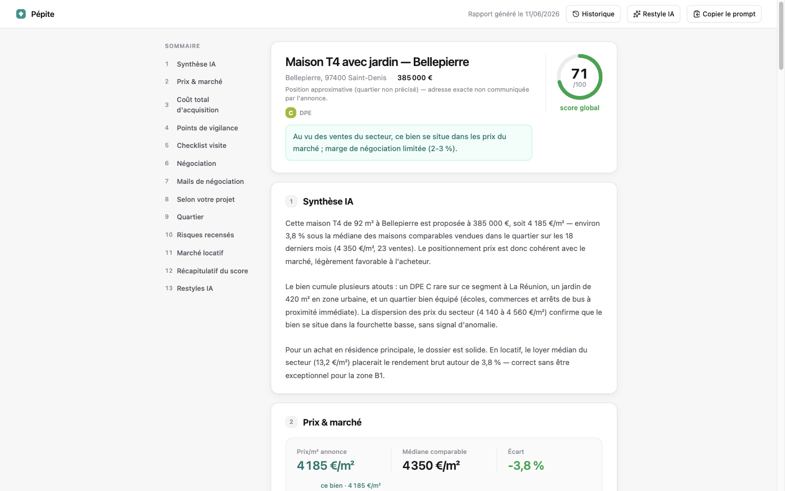
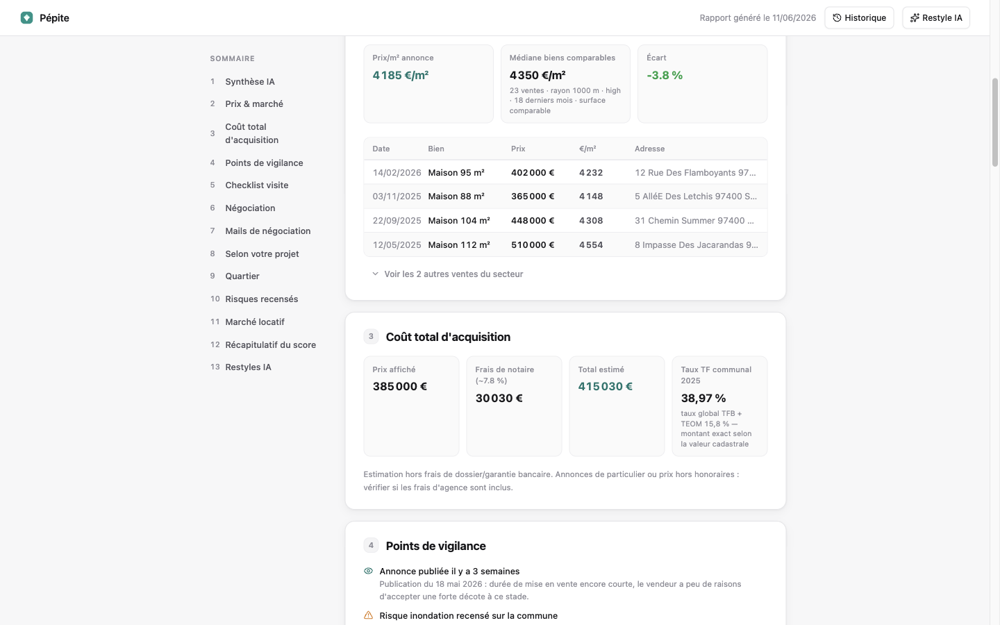
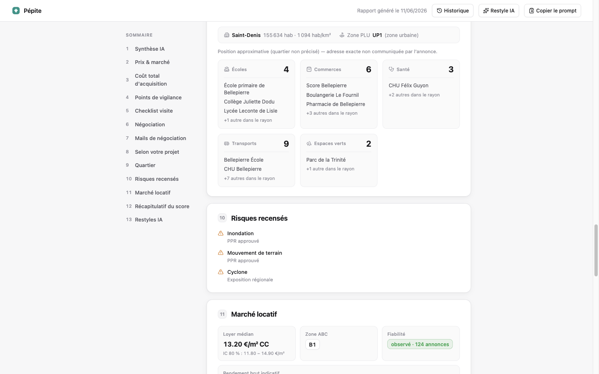
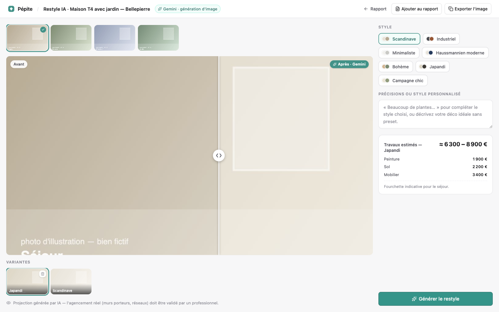
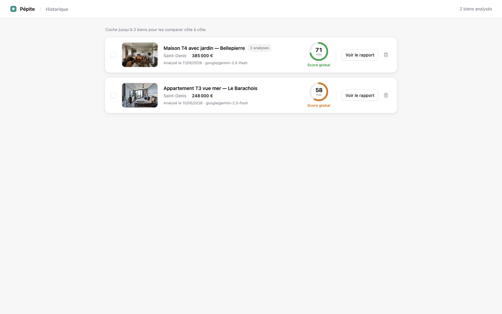
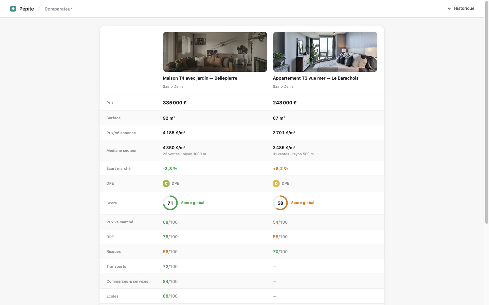

# Pépite 💎

Extension Chrome open source d'analyse de biens immobiliers en France. Ouvrez une annonce, Pépite vous dit si le prix est juste — données publiques (DVF, Géorisques, OSM…) + analyse IA avec **vos propres clés API**.

> Projet personnel, sans backend : tout tourne dans votre navigateur, vos clés et vos données restent en local.

## Fonctionnalités

- **Badge in-page** sur l'annonce : score prix instantané vs ventes réelles du secteur (DVF)
- **Side panel** : prix/m², médiane des biens comparables, écart marché
- **Analyse IA complète** (un seul appel LLM ; les mails de négociation font un appel séparé, à la demande) : synthèse, points de vigilance, fourchette et arguments de négociation, checklist de visite, avis pour 4 profils (résidence principale, location nue, Airbnb, colocation)
- **Rapport complet** : comparables datés et adressés, coût total d'acquisition (frais de notaire), score global pondéré (prix, DPE, risques, quartier, tension locative), quartier (écoles, commerces, santé, transports, espaces verts via OpenStreetMap), risques (Géorisques), marché locatif (carte des loyers + zonage ABC), contexte communal (population, zonage PLU, taux de taxe foncière)
- **Mails de négociation** : 3 tons (assertif, modéré, aimable) générés à partir des données du rapport, à copier-coller
- **Restyle IA** 🛋️ : sélectionnez une photo de l'annonce et faites-la redécorer par Gemini selon un style (scandinave, industriel, japandi…) ou votre description — avec estimation du coût des travaux, slider avant/après, variantes sauvegardées
- **Historique & comparateur** : toutes vos analyses, comparaison côte à côte de 2-3 biens

### Sites supportés

Leboncoin, SeLoger et Citya (parseurs dédiés, instantanés) ; autres sites immobiliers (Bien'ici…) via extraction IA générique (nécessite une clé API).

## Galerie

*Captures sur un bien fictif de démonstration — photos [Unsplash](https://unsplash.com/license), données simulées ; l'avant/après du studio est réalisé avec Gemini.*

**Rapport complet** — synthèse IA, score global et recommandation :



| Prix & marché (ventes DVF réelles, coût d'acquisition) | Quartier, risques et contexte communal |
|---|---|
|  |  |

**Studio Restyle IA** — photo de l'annonce redécorée par Gemini, slider avant/après, variantes et estimation travaux :



| Historique des analyses | Comparateur côte à côte |
|---|---|
|  |  |

## Installation

### Installation rapide (zip pré-buildé)

1. Téléchargez `pepiteextension-X.Y.Z-chrome.zip` depuis la [dernière release](https://github.com/jonathan-pyt/pepite/releases/latest) et décompressez-le
2. Ouvrez `chrome://extensions`, activez le **Mode développeur** (en haut à droite)
3. « Charger l'extension non empaquetée » → sélectionnez le dossier décompressé

> Pas encore sur le Chrome Web Store : pas de mise à jour automatique, re-téléchargez le zip à chaque release.

### Firefox (expérimental)

1. Téléchargez `pepiteextension-X.Y.Z-firefox.zip` depuis la [dernière release](https://github.com/jonathan-pyt/pepite/releases/latest)
2. Ouvrez `about:debugging#/runtime/this-firefox` → « Charger un module complémentaire temporaire… » → sélectionnez le zip

Le panneau s'ouvre via le badge Pépite sur une annonce, ou via la sidebar de Firefox (Ctrl+Alt+S / menu Affichage → Panneau latéral). Si votre version de Firefox n'accorde pas les accès à l'installation, le panneau affiche un bandeau « Autoriser » — un clic suffit, puis rechargez l'onglet de l'annonce.

> ⚠️ Installation **temporaire** : l'extension disparaît au redémarrage de Firefox. Firefox stable refuse les extensions non signées en installation permanente (seuls Developer Edition / Nightly le permettent via `xpinstall.signatures.required=false`). Une publication signée sur addons.mozilla.org viendra lever cette limite.

### Depuis les sources

```bash
git clone https://github.com/jonathan-pyt/pepite.git
cd pepite
pnpm install
cd packages/extension
pnpm build
```

Puis `chrome://extensions` → Mode développeur → « Charger l'extension non empaquetée » → `packages/extension/.output/chrome-mv3`.

**Configuration** : icône Pépite → clic droit → Options → choisir un provider (Gemini / Claude / OpenAI) et coller votre clé API. Le score prix fonctionne sans clé ; l'analyse IA, l'extraction générique et le Restyle en demandent une (Restyle = Gemini uniquement, ~0,04 $/image).

> **Pas de clé API ?** Créez une clé Gemini gratuite en 2 minutes sur [Google AI Studio](https://aistudio.google.com/apikey) ([documentation](https://ai.google.dev/gemini-api/docs/api-key)). ⚠️ Le palier gratuit est limité en débit (quelques requêtes par minute et un quota journalier) — largement suffisant pour analyser des annonces au fil de vos recherches, mais le Restyle (génération d'image) peut nécessiter d'activer la facturation selon les quotas du moment.

## Architecture

```
packages/core        Logique métier en TypeScript pur (zéro dépendance Chrome)
  extraction/        Parseurs par site + extracteur générique LLM
  enrichment/        Géocodage BAN, DVF, OSM/Overpass, Géorisques, loyers, commune/PLU/TF
  scoring/           Score prix, score global pondéré, coût d'acquisition
  analysis/          Prompts + appels LLM (AI SDK v6, multi-provider)
  restyle/           Édition d'image Gemini + estimation travaux
packages/extension   Extension Chrome MV3 (WXT + React 19 + Tailwind v4 + shadcn/ui)
```

Le découpage core/extension permet de réutiliser toute la logique hors navigateur (tests, CLI, autre front).

## Dev

```bash
pnpm install
pnpm test                              # tests core (Vitest, ~278 tests)
pnpm typecheck                         # dans chaque package
cd packages/extension && pnpm dev      # Chrome avec HMR
```

## Données utilisées

| Source | Usage | Licence/Accès |
|---|---|---|
| [DVF géolocalisées](https://files.data.gouv.fr/geo-dvf/) | Ventes réelles, médiane du secteur | Licence ouverte |
| [BAN / Géoplateforme](https://data.geopf.fr) | Géocodage des adresses | Licence ouverte |
| [Overpass / OpenStreetMap](https://overpass-api.de) | Commodités du quartier | ODbL |
| [Géorisques](https://www.georisques.gouv.fr) | Risques naturels et technologiques | Licence ouverte |
| Carte des loyers + zonage ABC | Marché locatif | Licence ouverte |
| [geo.api.gouv.fr](https://geo.api.gouv.fr) | Population communale | Licence ouverte |
| [Géoportail de l'Urbanisme](https://apicarto.ign.fr) | Zonage PLU | Licence ouverte |
| [data.economie.gouv.fr](https://data.economie.gouv.fr) | Taux de taxe foncière | Licence ouverte |

L'annonce est lue depuis la page que **vous** visitez ; rien n'est envoyé ailleurs que chez votre provider LLM. Clés API stockées en local (`chrome.storage.local`), jamais synchronisées. Détails : [politique de confidentialité](PRIVACY.md).

## Avertissements

Pépite est un outil d'aide à la décision, pas un conseil en investissement. Les scores, estimations de loyers, de travaux et de taxes sont **indicatifs** ; les rendus Restyle sont des projections IA (l'agencement réel doit être validé par un professionnel). Vérifiez toujours les données avant d'engager quoi que ce soit.

## Licence

[MIT](LICENSE)
